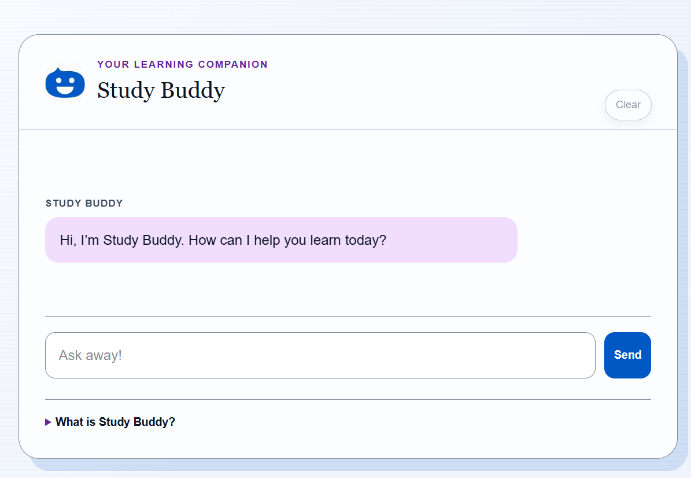

This is a beginner-friendly Next.js app for a study-buddy AI chatbot.

## Getting Started

First, run the development server:

```bash
npm run dev
# or
yarn dev
# or
pnpm dev
# or
bun dev
```

Open [http://localhost:3000](http://localhost:3000) with your browser to see the result.

You can start editing the page by modifying `app/page.tsx`. The page auto-updates as you edit the file.

This project uses [`next/font`](https://nextjs.org/docs/app/building-your-application/optimizing/fonts) to automatically optimize and load [Geist](https://vercel.com/font), a new font family for Vercel.

## Learn More

To learn more about Next.js, take a look at the following resources:


You can check out [the Next.js GitHub repository](https://github.com/vercel/next.js) - your feedback and contributions are welcome!

## Deploy on Vercel

The easiest way to deploy your Next.js app is to use the [Vercel Platform](https://vercel.com/new?utm_medium=default-template&filter=next.js&utm_source=create-next-app&utm_campaign=create-next-app-readme) from the creators of Next.js.

Check out our [Next.js deployment documentation](https://nextjs.org/docs/app/building-your-application/deploying) for more details.

## Study Buddy setup

1. Install dependencies with `npm install`.
2. Create your local environment file:

	```bash
	copy .env.example .env.local
	```

3. Add your Groq API key to `.env.local`:

	```env
	GROQ_API_KEY=your_groq_api_key_here
	```

4. Start the app with `npm run dev` and open http://localhost:3000.

## Windows note

If PowerShell blocks npm scripts, run this once before starting the app:

```powershell
Set-ExecutionPolicy -Scope Process -ExecutionPolicy Bypass
```

Alternatively, run `npm run dev` from Command Prompt.

## Security

- Never commit `.env.local`.
- Keep API keys in local environment variables only.
- Use `.env.example` as the safe setup template.


# 🏷️ Study Buddy

---

Study Buddy is an AI chatbot to help students study. Students can ask anything and the bot will answer. 

---





Du kan exempelvis skapa en mapp:

```text
project/
├── images/
│   └── screenshot.png
├── src/
└── README.md
```

> [!TIP]
> Använd en beskrivande `alt`-text istället för exempelvis `image1`.

Bra:

```md

```

Mindre bra:

```md

```

---

# 🎬 GIF eller demo

En kort GIF kan visa hur applikationen fungerar.

```md

```

Det fungerar på samma sätt som en vanlig bild.

---

# 🌐 Live Demo

Om projektet är publicerat kan du länka till det.

```md
## Live Demo

👉 [Testa applikationen](https://example.com)
```

---

# 🚀 Features

Lista projektets viktigaste funktioner.

```md
## Features

- 🔎 Sök efter filmer
- 🎬 Visa detaljerad information
- ❤️ Spara favoritfilmer
- 📱 Responsiv design
- 🌙 Dark mode
```

Försök hålla listan tydlig och konkret.

---

# 🛠️ Technologies

Visa vilka tekniker projektet använder.

```md
## Technologies

- HTML
- CSS
- TypeScript
- React
- Vite
- Git
- GitHub
```

Du kan också använda en tabell:

```md
| Technology | Used for |
|------------|----------|
| React | User interface |
| TypeScript | Type safety |
| Vite | Development environment |
| CSS | Styling |
```

---

# 📦 Installation

Beskriv exakt hur någon annan startar projektet.

```md
## Installation

1. Klona repositoryt:

   ```bash
   git clone https://github.com/username/movie-explorer.git
   ```

2. Gå till projektmappen:

   ```bash
   cd movie-explorer
   ```

3. Installera dependencies:

   ```bash
   npm install
   ```

4. Starta utvecklingsservern:

   ```bash
   npm run dev
   ```


> [!IMPORTANT]
> En annan utvecklare ska helst kunna starta projektet utan att behöva fråga dig hur det fungerar.

---

# 🔑 Environment Variables

Om projektet använder API-nycklar eller andra miljövariabler bör de dokumenteras.

```md
## Environment Variables

Skapa en `.env`-fil i projektets root:

```env
VITE_API_KEY=your_api_key_here
```
```

Visa **inte** riktiga API-nycklar i README-filen.

Bra:

```env
VITE_API_KEY=your_api_key_here
```

Dåligt:

```env
VITE_API_KEY=abc123-my-real-secret-key
```

---

# ▶️ Usage

Förklara hur applikationen används.

```md
## Usage

1. Öppna applikationen.
2. Skriv en filmtitel i sökfältet.
3. Klicka på Search.
4. Klicka på en film för att visa mer information.
5. Klicka på hjärtat för att spara filmen som favorit.
```

---

# 📁 Project Structure

För större projekt kan det vara bra att visa hur filerna är organiserade.

```md
## Project Structure

```text
src/
├── components/
│   ├── MovieCard.tsx
│   └── SearchForm.tsx
├── pages/
│   ├── Home.tsx
│   └── Favorites.tsx
├── services/
│   └── movieApi.ts
├── types/
│   └── Movie.ts
└── main.tsx
```


Du behöver inte visa varje fil. Visa framför allt strukturen som hjälper läsaren förstå projektet.

---

# 🧠 How It Works

Förklara viktiga delar av projektet.

```md
## How It Works

Applikationen hämtar filmdata från ett externt API.

När användaren gör en sökning:

1. Sökformuläret skickas.
2. Ett API-anrop görs.
3. Resultatet konverteras till filmobjekt.
4. Filmerna renderas som `MovieCard`-komponenter.
```

Det här kan vara extra användbart i skolprojekt eller portfolio-projekt.

---

# 🔌 API

Om projektet använder ett externt API kan du beskriva det.

```md
## API

Projektet använder The Movie Database API för att hämta information om filmer.

Dokumentation:

https://developer.themoviedb.org/
```

Eller som länk:

```md
[The Movie Database API](https://developer.themoviedb.org/)
```

---

# 📋 Requirements

Om projektet kräver vissa verktyg kan de listas.

```md
## Requirements

- Node.js 20+
- npm
- Git
```

---

# 🧪 Testing

Beskriv hur tester körs.

```md
## Testing

Kör tester med:

```bash
npm test
```


Om ni använder ett speciellt testverktyg:

```md
Projektet använder Vitest för automatiserade tester.
```

---

# 🧹 Linting

```md
## Linting

Kontrollera koden med ESLint:

```bash
npm run lint
```


---

# 🏗️ Build

Visa hur projektet byggs för produktion.

```md
## Build

```bash
npm run build
```


---

# 🗺️ Roadmap

Beskriv funktioner som kan komma senare.

```md
## Roadmap

- [x] Filmsökning
- [x] Filmkort
- [x] Favoriter
- [ ] Dark mode
- [ ] Filtrering efter genre
- [ ] Inloggning
```

Det här är också ett exempel på Markdown-checklistor.

---

# 🐛 Known Issues

Om projektet har kända problem kan du vara öppen med dem.

```md
## Known Issues

- Favoriter sparas endast lokalt i webbläsaren.
- Layouten behöver förbättras på mycket små skärmar.
```

Det är ofta bättre än att låtsas att projektet är perfekt.

---

# 🤝 Contributing

Om andra får bidra till projektet kan du beskriva arbetsflödet.


## Contributing

1. Skapa en ny branch.

   ```bash
   git switch -c feature/my-feature
   ```

2. Gör dina ändringar.

3. Skapa en commit.

   ```bash
   git commit -m "Add my feature"
   ```

4. Pusha branchen.

5. Skapa en Pull Request.


---

# 👥 Authors


## Authors

- [Anna Andersson](https://github.com/anna)
- [Erik Eriksson](https://github.com/erik)


För ett individuellt projekt:


## Author

**Anna Andersson**

- GitHub: [@anna](https://github.com/anna)
- LinkedIn: [Anna Andersson](https://linkedin.com/)


---

# 📜 License

Om projektet har en licens:


## License

This project is licensed under the MIT License.


Du kan länka till licensfilen:


See the [LICENSE](./LICENSE) file for more information.


---

# 🙏 Credits / Acknowledgements

Om du har använt resurser från andra:

```md
## Credits

- Icons from [Font Awesome](https://fontawesome.com/)
- Movie data from [TMDB](https://www.themoviedb.org/)
- Design inspiration from ...
```

---

# 📚 Table of Contents

Längre README-filer kan ha en innehållsförteckning.

```md
## Table of Contents

- [Features](#features)
- [Technologies](#technologies)
- [Installation](#installation)
- [Usage](#usage)
- [Project Structure](#project-structure)
- [Author](#author)
```

GitHub skapar automatiskt länkar till rubriker.

---

# 🎨 Markdown Cheat Sheet

Nedan följer de vanligaste sakerna du behöver kunna för att skriva en snygg README.

---

# Rubriker

```md
# Rubrik 1

## Rubrik 2

### Rubrik 3

#### Rubrik 4
```

Använd helst bara **en `#`-rubrik** för projektets titel.

---

# Fet text

```md
**Det här är viktigt**
```

Resultat:

**Det här är viktigt**

---

# Kursiv text

```md
*Det här är kursivt*
```

Resultat:

*Det här är kursivt*

---

# Fet och kursiv

```md
***Väldigt viktigt***
```

---

# Genomstruken text

```md
~~Det här gäller inte längre~~
```

Resultat:

~~Det här gäller inte längre~~

---

# Punktlista

```md
- HTML
- CSS
- TypeScript
```

Resultat:

- HTML
- CSS
- TypeScript

---

# Numrerad lista

```md
1. Installera projektet
2. Starta servern
3. Öppna webbläsaren
```

---

# Nested Lists

```md
- Frontend
  - React
  - TypeScript
- Tools
  - Git
  - Vite
```

---

# Checklistor

```md
- [x] Skapa startsida
- [x] Lägg till API
- [ ] Lägg till dark mode
```

Resultat:

- [x] Skapa startsida
- [x] Lägg till API
- [ ] Lägg till dark mode

---

# Inline Code

Använd backticks runt kod.

```md
Kör `npm install` för att installera projektet.
```

Resultat:

Kör `npm install` för att installera projektet.

---

# Code Blocks

Tre backticks skapar ett kodblock.

````md
```js
const message = "Hello World";
console.log(message);
```
`````

Du kan ange språk för syntax highlighting:

```text
js
ts
tsx
html
css
json
bash
md
```

Exempel:

````md
```ts
interface Movie {
  id: number;
  title: string;
}
```
````

---

# Blockquotes

```md
> Det här är ett citat eller viktig information.
```

Resultat:

> Det här är ett citat eller viktig information.

---

# GitHub Callouts

GitHub har stöd för särskilda callouts.

## Note

```md
> [!NOTE]
> Bra information att känna till.
```

## Tip

```md
> [!TIP]
> Ett praktiskt tips.
```

## Important

```md
> [!IMPORTANT]
> Något användaren verkligen behöver känna till.
```

## Warning

```md
> [!WARNING]
> Något som kan skapa problem.
```

## Caution

```md
> [!CAUTION]
> Något som kan få allvarliga konsekvenser.
```

---

# Länkar

```md
[GitHub](https://github.com)
```

Resultat:

[GitHub](https://github.com)

---

# Länka till en fil i repositoryt

```md
[Läs dokumentationen](./docs/documentation.md)
```

---

# Länka till en rubrik

```md
[Hoppa till Installation](#installation)
```

---

# Bilder

```md

```

---

# Klickbar bild

```md
[](https://example.com)
```

När användaren klickar på bilden öppnas länken.

---

# Ändra bildstorlek med HTML

Markdown låter dig inte enkelt ändra storlek på bilder.

GitHub tillåter därför viss HTML:

```html

```

---

# Centrera innehåll

HTML kan även användas för centrering.

```html
<p align="center">
  
</p>
```

---

# Horisontell linje

```md
---
```

Resultat:

---

# Tabeller

```md
| Feature | Status |
|---------|--------|
| Search | ✅ |
| Favorites | ✅ |
| Dark Mode | 🚧 |
```

Du kan styra textjustering:

```md
| Left | Center | Right |
|:-----|:------:|------:|
| Text | Text | Text |
```

---

# Escape Characters

Om du vill skriva ett Markdown-tecken utan att det formatteras kan du använda `\`.

```md
\# Det här blir inte en rubrik
```

---

# Emojis

Vanliga emojis fungerar direkt:

```md
🚀 🎬 ❤️ 🔎 📦 ✅ ❌
```

Använd dem gärna för att skapa struktur, men överdriv inte.

---

# Badges

Badges används ofta högst upp i README-filen.

Exempel:

```md

```

Andra vanliga badges kan visa:

* Build status
* Version
* License
* Downloads
* GitHub Stars
* Test status
* Code coverage

> [!TIP]
> Använd badges som faktiskt tillför information.
> Tio slumpmässiga badges gör inte automatiskt en README bättre.

---

# Expanderbara sektioner

GitHub stödjer HTML-elementet `<details>`.

```html
<details>
  <summary>Visa mer information</summary>

  Här kan du lägga text, kod eller annan information.

</details>
```

Bra för:

* långa installationer
* avancerade exempel
* FAQ
* extra information

---

# Tangentbordstangenter

Du kan använda HTML:

```html
Tryck på <kbd>Ctrl</kbd> + <kbd>C</kbd>.
```

Resultat:

Tryck på <kbd>Ctrl</kbd> + <kbd>C</kbd>.

---

# Kommentarer som inte visas

HTML-kommentarer visas inte i README-filen.

```html
<!-- TODO: Lägg till screenshot här -->
```

Bra när du vill lämna anteckningar till dig själv eller gruppen.

---

# 🔥 Exempel på komplett struktur

En ganska komplett README kan se ut så här:

````md
# Project Name

Kort beskrivning av projektet.


## Live Demo

[Open application](https://example.com)

## Features

- Feature one
- Feature two
- Feature three

## Technologies

- TypeScript
- React
- Vite

## Installation

```bash
git clone ...
cd project
npm install
npm run dev
````

## Environment Variables

```env
VITE_API_KEY=your_api_key
```

## Usage

Beskriv hur projektet används.

## Project Structure

```text
src/
├── components/
├── services/
└── main.ts
```

## Roadmap

* [x] First feature
* [ ] New feature

## Known Issues

* ...

## Authors

* [Name](https://github.com/username)

## License

MIT


---

# ✅ Checklista – Är din README klar?

Innan du är färdig, kontrollera:

- [ ] Projektet har en tydlig titel.
- [ ] Det finns en kort och begriplig beskrivning.
- [ ] Det framgår vad projektet gör.
- [ ] Viktiga funktioner är listade.
- [ ] Teknikerna som används finns dokumenterade.
- [ ] Det finns tydliga installationsinstruktioner.
- [ ] Eventuella miljövariabler är dokumenterade.
- [ ] README-filen innehåller minst en relevant bild om projektet har ett UI.
- [ ] Eventuell live-demo är länkad.
- [ ] Länkar fungerar.
- [ ] Bilder visas korrekt.
- [ ] Kodblock har rätt språk angivet.
- [ ] Rubrikerna har en tydlig struktur.
- [ ] Det finns inga stora, svårlästa textblock.
- [ ] Stavning och språk har kontrollerats.
- [ ] Informationen är fortfarande aktuell.

---

# 💡 Sista tipset

En README ska inte försöka vara så avancerad som möjligt.

Den ska vara **så enkel som möjligt att förstå**.

> [!IMPORTANT]
> En bra README gör att en person som aldrig tidigare sett projektet snabbt kan förstå vad det är, hur det fungerar och hur man kommer igång.

**Bra dokumentation är en del av bra utveckling. 🚀**